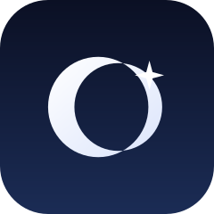

<div align="center">



# Firmament

**Point your iPhone at the real sky and understand it. Then capture it.**

[](./LICENSE)
[](#requirements)
[](#requirements)
[](#license--attribution)
[](#contributing)

A native iOS app that fuses the phone's camera, LiDAR, GPS, compass, and motion
sensors with real astronomical data — a live AR sky identifier and a tripod-aware
night-sky camera in one, with an AI photo editor that recovers the real sky from
your dark frames. The **open-source** field companion to the web
[Universe Engine](https://www.sinhaankur.com/lab/celestial).

*100% custom Swift · no third-party dependencies · on-device · offline · private*

</div>

---

## What it does

- **Explore** — hold the phone up and stars, planets, the Sun/Moon (with phase),
  and constellations get labeled in real time, anchored to their true direction
  in *your* sky, from *your* location, *right now*. Tap any label for the facts.
- **Spot** *(roadmap)* — arrows guide you to where the ISS and bright satellites
  are passing overhead, with a live countdown to the next visible pass.
- **Capture** — set the phone on a tripod and Firmament detects it's steady, then
  pushes the camera to its limit: long exposure **+** RAW frame-stacking **+**
  system night-mode assist, behind one clean shutter. An on-device **Capture
  Advisor** reads the weather + Moon + darkness and tells you what to shoot and
  how. Each shot is annotated with what was in frame.
- **Edit** — every capture opens in an in-app editor that **auto-develops** the
  frame: it measures the exposure your shot was taken at and recovers the real
  night sky from what looks like a black frame (the problem that inspired it),
  then explains — on-device, via **Apple Intelligence** where available — what
  the shot is and how it was captured. Manual exposure/contrast/warmth/shadows +
  a one-tap "reveal faint stars" boost, then save.
- **Telescope** — connect a **Celestron** computerized mount (NexStar SE/SLT/
  Evolution, CPC, Advanced VX, CGX, Astro Fi…) over its SkyPortal WiFi module.
  Tap any object Firmament has identified and **point the telescope at it**;
  captures are stamped with the mount's exact coordinates. Built from a
  from-scratch Swift implementation of Celestron's NexStar protocol.

Everything runs **on-device and offline** (the optional weather lookup is the
only network call, and sends nothing but a coarse lat/lon). No account. No
third-party frameworks — **100% custom code**. Your location and photos never
leave the phone.

## Engines

Firmament is built around two named engines, plus supporting modules — the same
"engine" discipline as the web Universe Engine:

- **NightSkyEngine** — the astronomy core. Pure, offline, deterministic: Julian
  date → sidereal time → RA/Dec → alt/az, Sun/Moon/planet ephemeris, and the
  bright-star catalog. No UI, no network.
- **CameraEngine** — owns the live camera, picks the strongest lens, and detects
  the device's **real** capture limits at runtime (`DeviceCaptureProfile`), then
  drives the `NightCapture` pipeline (long exposure + RAW frame-stacking).
- **TelescopeEngine** — bridges the catalog to a Celestron mount via a custom
  **NexStarClient** (GOTO, position read-back, alignment/slew status).
- **CaptureAdvisor** — a model-free rule engine that recommends settings from
  real conditions; an optional on-device LLM only *phrases* its output.
- **AutoDevelop + editor** — measures the captured frame (mean luminance) and its
  capture settings and computes the recovery to reveal the real sky; **Apple
  Intelligence** (Foundation Models, on-device) narrates what the shot is. The
  math decides the numbers; the model only explains.

## How the sky is computed

Positions ride on Apple's built-in frameworks for the observer frame
(**CoreLocation** for place + true heading, **CoreMotion** for where the phone
points and whether it's steady) plus standard Meeus / JPL-approximate math for the
bodies:

- Sun — Meeus ch. 25 apparent geocentric position.
- Moon — abridged ELP series + illuminated-fraction phase.
- Planets — Keplerian elements with linear rates (JPL "approximate positions",
  valid 1800–2050), solved through Kepler's equation.
- Stars — a bundled bright-star catalog (J2000 RA/Dec + magnitude).

Accuracy is *naked-eye pointing* grade — the right tool for a phone in a field.
Where a value is inferred or approximate, the UI says so; nothing is presented as
more exact than it is. Same fidelity philosophy as the web engine: **real over
invented, reverence over spectacle.**

## Requirements

- **iPhone 17 Pro** is the reference device (LiDAR foreground occlusion + Pro
  cameras). Runs on any iPhone on iOS 17+; without LiDAR, foreground occlusion
  degrades gracefully to a horizon line.
- **Celestron mount (optional):** any computerized Celestron with a SkyPortal
  WiFi module (or built-in WiFi on Evolution / Astro Fi). Firmament works fully
  without one.
- Xcode 26+, Swift 5+ (builds clean under the Swift 6 toolchain).

## Build & run on your own device

The Xcode project is generated from [`project.yml`](./project.yml) via
[XcodeGen](https://github.com/yonaskolb/XcodeGen) so it stays diff-friendly.

```bash
brew install xcodegen        # one-time
git clone https://github.com/sinhaankur/Firmament.git
cd Firmament
xcodegen generate            # creates NightSky.xcodeproj
open NightSky.xcodeproj
```

Then in Xcode:

1. Select the **NightSky** target → **Signing & Capabilities**.
2. Pick your **Team** (a free Apple ID works for on-device testing).
3. Plug in your iPhone, select it as the run destination, and press **⌘R**.

The first launch will ask for camera, location, and motion permission — all three
are needed for the sky to line up and for capture to work.

## Install (no Mac needed)

Apple does not allow public `.ipa` downloads, so beta distribution is via
**TestFlight** and general availability via the **App Store**. The install page
holds the links:

➡️ **[Install page](https://sinhaankur.github.io/Firmament/)** — TestFlight (iOS,
coming) · Android (planned).

## Android & cross-platform

Android is a *separate* native app (ARCore + CameraX + platform depth), sharing
this repo's [`DESIGN.md`](./DESIGN.md) as the spec. It lives under
[`android/`](./android/) and is marked **planned** — we don't pretend one binary
ships both platforms. Cross-platform is a roadmap commitment, tracked honestly.

## Project layout

```
DESIGN.md            Full concept + architecture + roadmap
project.yml          XcodeGen project definition (source of truth)
Sources/
  App/               App entry + root view
  Sensors/           CoreLocation + CoreMotion services
  NightSkyEngine/    Pure astronomy: math, ephemeris, catalogs (no UI, offline)
  CameraEngine/      Camera session, device profile, Night Capture pipeline
  AR/                Sky→screen projection
  Advisor/           CaptureAdvisor + weather + on-device LLM phrasing hook
  Telescope/         NexStarClient + TelescopeEngine (Celestron control)
  UI/                SwiftUI screens (Explore / Spot / Capture, InfoCard, sheets)
Resources/           Info.plist, asset catalog
docs/                Install landing page + CAMERA-PROFILES.md research
android/             Planned native port (shares DESIGN.md)
```

## Status

Phase 0 (this milestone): the app builds and runs on-device — live camera sky,
real Sun/Moon/planet/star labels from your location and time, tap-to-inspect, and
a tripod-gated Night Capture path. Explore/Spot/Capture roadmap is in
[`DESIGN.md`](./DESIGN.md).

## License & attribution

MIT © **Ankur Sinha** (sinhaankur@ymail.com). See [`LICENSE`](./LICENSE).

**All code is custom** — hand-written Swift on Apple frameworks, with **no
third-party libraries or SDKs**. That includes the astronomy, the camera
pipeline, the capture advisor, and the Celestron **NexStar** protocol client.

Only *reference data and public specifications* are credited (never anyone else's
code):

- Astronomical algorithms after Jean Meeus, *Astronomical Algorithms*.
- Planetary elements from JPL's approximate-positions tables.
- Bright-star positions from the Yale Bright Star Catalogue / Hipparcos.
- Telescope control follows Celestron's public *NexStar Communication Protocol*
  (implemented from scratch; Celestron/NexStar/SkyPortal are their trademarks —
  Firmament is an independent, unaffiliated app).
